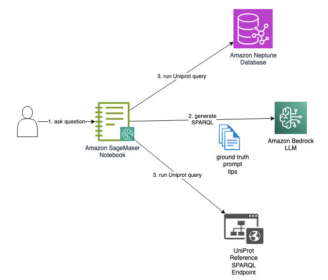
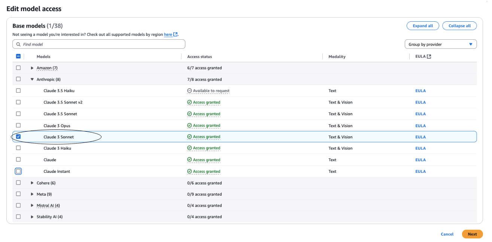

# Text-to-SPARQL Generation for UniProt

In this repository, we demonstrate how to ask natural language questions about proteins on the [Universal Protein Resource (UniProt)](https://www.uniprot.org/help/uniprotkb) dataset. UniProt is a graph dataset defined using [Resource Description Framework (RDF)](https://www.w3.org/RDF/). We can query it using RDF's [SPARQL](https://www.w3.org/TR/sparql11-query/) query language against a triple store that has the UniProt data. 

We demonstrate how to enable users who have domain knowledge of proteins (but are not necessarily developers proficient in SPARQL) to ask natural language questions about proteins and use a large language model (LLM) to convert the question to a SPARQL query. 

For example, if the user asks ```Select all bacterial taxa and their scientific names from the UniProt taxonomy```, we will attempt to have the LLM generate a SPARQL query like the following:

```
SELECT ?taxon ?name
    WHERE
    {
        ?taxon a up:Taxon .
        ?taxon up:scientificName ?name .
        ?taxon rdfs:subClassOf taxon:2 .
    }
```

We use the following design.

. 

The user asks a question on an [Amazon SageMaker](https://aws.amazon.com/sagemaker/) instance notebook instance. The notebook generates the SPARQL query using an LLM (Anthropic Claude) via [Amazon Bedrock](https://aws.amazon.com/bedrock). The notebook then runs that query against a UniProt database: either the [UniProf reference SPARQL endpoint](https://sparql.uniprot.org/) or your own [Amazon Neptune](https://aws.amazon.com/neptune/) database loaded with UniProt data.

To generate the query, we prompt the LLM with the question plus a set of ground-truth examples and tips. See [resources](resources) folder for tips, ground-truth, and prompts. We use a *few shot* approach. We give the LLM several examples of questions and their correct SPARQL query. We expect the LLM will use these to write the correct SPARQL for other UniProt questions. 

## Setup

To setup this solution, you need an AWS account with permission to provision use of a SageMaker notebook instance, Bedrock models, a Neptune cluster, and an [Amazon Simple Storage Service (S3)](https://aws.amazon.com/s3/) bucket. 

### Enable Bedrock model access

In your AWS console, open the Bedrock console and request model access for _Claude 3.5 Sonnet_ under _Anthropic_. For instructions how to request model access, follow <https://docs.aws.amazon.com/bedrock/latest/userguide/model-access.html>.

Check back until the model shows as _Access granted_.

. 

### (Optional) Create Amazon Simple Storage Service (S3) Bucket
Create an Amazon Simple Storage Service (S3) bucket in the same account and region in which you deploy the other resources. This bucket is used to stage UniProt data for load into the Neptune database. If you don't intend to use the Neptune database, you may skip this step.

Follow instructions in [https://docs.aws.amazon.com/AmazonS3/latest/userguide/create-bucket-overview.html](https://docs.aws.amazon.com/AmazonS3/latest/userguide/create-bucket-overview.html). The bucket may be private and use default encryption. Take note of your bucket name and resource ARN for upcoming deployment steps.

### (Optional) Setup Amazon Neptune Cluster
Create a Neptune cluster and a notebook instance. One way to setup these resources is using the CloudForamtion template via [https://docs.aws.amazon.com/neptune/latest/userguide/get-started-cfn-create.html](https://docs.aws.amazon.com/neptune/latest/userguide/get-started-cfn-create.html). We recommend using a `NotebookInstanceType` of `ml.t3.medium` or higher. If you don't intend to use the Neptune database, you may skip this step.

### Setup notebook
We use Jupyter as our test client. If you setup a Neptune cluster, a Sagemaker notebook instance has already been created for you, but additional setup steps are reuired. If you did not setup a Neptune cluster, you can provision a SageMaker notebook instance or install Jupyter in a non-SageMaker environment.

#### Option 1: Notebook created with Neptune
In the SageMaker console, locate the notebook instance that was created by the Neptune cluster CloudFormation stack. Find its IAM role under `Permissions and encryption` on the details page for the notebook. Select that role and add the following IAM managed policies as follows:

- `AmazonS3FullAccess`. The notebook should already have read access to all S3 buckets. But you also need write access to the S3 bucket you created above.
- `AmazonBedrockFullAccess`: The notebook needs access to Bedrock. 

#### Option 2: Create SageMaker notebook instance

Create a SageMaker notebook instance. Choose ```Amazon Linux 2, Jupyter Lab 3``` are platform identifier. Ensure the IAM role for the instance has full Bedrock access. Ensure the instance's network allows connectivity to both the Bedrock service and the public internet. 

See <https://docs.aws.amazon.com/sagemaker/latest/dg/howitworks-create-ws.html>.

## Run the solution
In your notebook instance, clone this repository. Run the notebooks in the following order:

1. (Optional) Open [uniprot_loader.ipynb](uniprot_loader.ipynb) to load Uniprot data to your Neptune database. Run through the cells: set the name of the S3 staging bucket that you created; synchronize a copy of the UniProt files from a public bucket to your staging bucket; bulk-load the files from your staging bucket to the Neptune cluster; then verify by running sample SPARQL queries on the Neptune database.
2. Open [get_expected_results.ipynb](get_expected_results.ipynb) to run each of the ground-truth example queries -- which you can find in [resources/ground-truth.yaml](resources/ground-truth.yaml) -- against either the UniProt reference site or your Neptune database. The results are written to a local folder called ```up``` (if run against UniProt reference) or ```expected``` (if run against Neptune database). We provide a copy of that folder in this repo -- [up](up) -- for comparison. 
3.  Open [run_gen_tests.ipynb](run_gen_tests.ipynb) to test LLM generation of natural language UniProt questions. The notebook tests each question in ground truth, prompting the LLM to generate SPARQL for each, then running the generated SPARQL against either the UniProf reference site (by default) or your Neptune database. Results are written to the local ```gen_results``` folder. We provide a copy of that folder in this repo -- [gen_results](gen_results) -- for comparison. You can also ask your own question too. See ```run_yourown_query()``` examples.
4. Open [compared_expected_gen.ipynb](compared_expected_gen.ipynb) to compare expected and actual queries. The notebook effectively compares results of the previous two notebooks. It presents its results for side-by-side comparison, question by question, in HTML form. You can review our results in [comparison.html](comparison.html).
   

## Cleanup
If you are done and wish to avoid further charges, remove the solution as follows:

- Delete the CloudFormation stack you created for the Neptune cluster and notebook instance. See <https://docs.aws.amazon.com/AWSCloudFormation/latest/UserGuide/cfn-console-delete-stack.html> for instructions how to delete a stack.
- Remove the S3 bucket. See <https://docs.aws.amazon.com/AmazonS3/latest/userguide/delete-bucket.html>.
- If you created a SageMaker notebook instance, remove it. See <https://docs.aws.amazon.com/sagemaker/latest/dg/ex1-cleanup.html>.

## Cost

This solution incurs cost. Refer to pricing guides for [Neptune](https://aws.amazon.com/neptune/pricing/), [S3](https://aws.amazon.com/s3/pricing/), [Bedrock](https://aws.amazon.com/bedrock/pricing/)], and [SageMaker](https://aws.amazon.com/sagemaker/pricing/).

